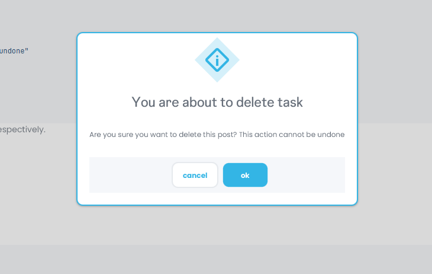
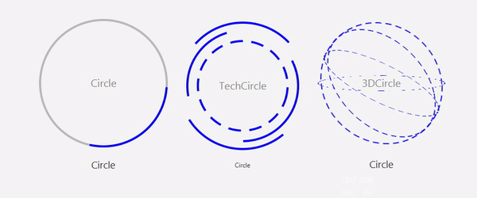

# History / Changelog

All notable changes to this project will be documented in this file.

## 3 Jun 2026
I've been tired to recreate the drawer.. so I separate it to a Nav class for this project
a SideNav as component to reuse and a new call to Root to create a drawer.
```java
    // simple call to create a drawer.
    root.behavior().drawer()
        .content(nav)
        .show();
```

## 27 May 2026
- I've been learning about maintain a history and make more intuitive.
- Making this will be help me :D to stay update.

## 2025-09-04 
######  Alerts types style.


## 2025-08-29
That's why I believe it's a beautiful circular loader.
You can see in the drawer module <br> Circular Loaders. <br>


## 2025-08-25
That's why I believe it's a beauty profile page.


## 2025-08-20
That's my first view of dash, I've been thinking about what that can be more awesome.
I'm just struggling of what information put in.

