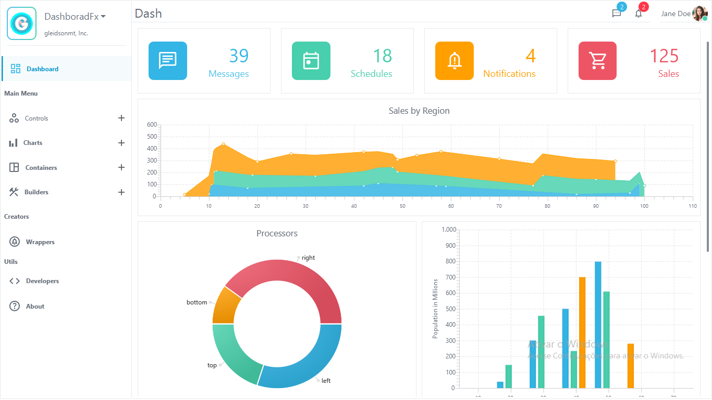

<h1 align="center">DashboardFx</h1>
<h6 align="center"> This project is part of the set of custom components created for JavaFx. </h6>
<h1></h1>

  

## Preview

  

# 🛠 Enhancements
...
# 📑 Contents

<!-- TOC -->
  * [Preview](#preview)
* [🛠 Enhancements](#-enhancements)
* [📑 Contents](#-contents)
* [💻 Environment](#-environment)
* [🚀 Installing](#-installing)
* [☕ Using Dashboard](#-using-dashboard)
* [🧬  Basic Structure](#-basic-structure)
* [📺 On Youtube](#-on-youtube)
* [🛠 Enhancements](#-enhancements)
* [📫 Contributing to Project](#-contributing-to-project)
* [😄 Be a contritubutor ](#-be-a-contritubutor-br)
* [📝 License](#-license)
<!-- TOC -->

# 💻 Environment

This lib is a compnent for JavaFx:   Get in the offical website [JavaFx](https://openjfx.io/), Tutorial [Getting Started](https://openjfx.io/openjfx-docs/)

I have a great workstation here, then I've using a gradle 7.2 and Java and JavaFx +16 on Windows. (I really want to test in other systems in future).

# 🚀 Installing
...
# ☕ Using Dashboard
...
# 🧬  Basic Structure
... 
# 📺 On Youtube
...
# 🛠 Enhancements
...

# 📫 Contributing to Project
<!---Se o seu README for longo ou se você tiver algum processo ou etapas específicas que deseja que os contribuidores sigam, considere a criação de um arquivo CONTRIBUTING.md separado--->
To contributing to project, follow these steps:

1. Fork this repository.
2. Creates a branch: `git checkout -b <branch_name>`.
3. Do your changes and commit: `git commit -m '<commit_message>'`
4. Send a branch to origin: `git push origin DashboardFx / <local>`
5. Creates pull request.

However, if you don't know [How to create a pull Request](https://help.github.com/en/github/collaborating-with-issues-and-pull-requests/creating-a-pull-request).

# 😄 Be a contritubutor 

🤖I really need more friends.. Send me a  <a href='mailto:gleidisonmt@gmail.com?subject=Hi, I see you need my help!.. I am here.'> email <a/>.

# 📝 License

This project is under license. See the file [LICENSE](LICENSE.md) to more details.

[⬆ Back to the top](#DashboardFx) 