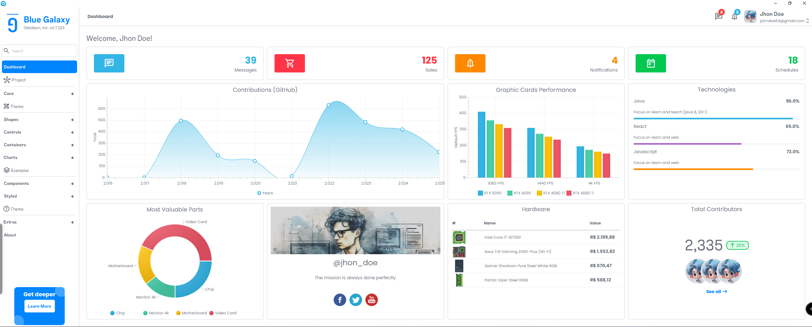

# DashboardFx

[](HISTORY.md)
[](https://github.com/gleidsonmt/DashboardFX/blob/alpha/LICENSE.txt)


<p style="text-align: center">
  
</p>

<!-- TOC -->
* [DashboardFx](#dashboardfx)
* [📑 Overview](#-overview)
* [💻 Environment](#-environment)
* [☕ Running](#-running)
* [🚀 Installing](#-installing)
* [📺 On Youtube](#-on-youtube)
* [🛠 Enhancements](#-enhancements-)
* [📫 Contributing to Project](#-contributing-to-project)
* [😄 Be a contributor<br>](#-be-a-contributorbr)
* [📝 License](#-license)
<!-- TOC -->

<br>

# 📑 Overview

Hi guys, I'm back, with more, after these years I looked for some things that can be really good-looking to build, and I want to share it.
In this example, you can see how components in Javafx can be worked to align with a good design (I try). 
This time I use more time to create more tutorials and unify libs.
When the app is running, you can have a tutorial about creating these things showed inside it.

# 💻 Environment

This is a project build using JavaFx, Official website [JavaFx](https://openjfx.io/), Tutorial [Getting Started](https://openjfx.io/openjfx-docs/)

I've used a gradle 8.13 (preference for wrapper) and Java and JavaFx 23+ on Windows.
You'll find the jars in the folder called vendor.
All libs are included in build.gradle

# ☕ Running

Clone the project using.
```
    git clone --recursive https://github.com/gleidsonmt/DashboardFx.git
```
This command will clone the project and all submodules.<br>
Building using gradle wrapper is simple just run the command below.
```
    .\gradlew init
    .\gradlew build
    .\gradlew run
```
In the order. <br>
First prepares the project. <br>
Second builds the project. <br>
Third runs the project. <br>

Just build and run -(º-º)- there's no trick… only use Gradle to build and run in your ide.
Use the command build and run to see the application running. 
If you have problems, open an issue.


# 🚀 Installing
I really recommend using jpackage to create your jar and the .exe. <br>
!🗒️Note ** To generate you .exe you need the wix tool, you can get the url if you are using intellij or from here  https://wixtoolset.org 🥸***
In intellij or Visual Studio (in visual you need to prepare the ide to use javafx) it's really simple, only open the tab gradle and run the command build after jpackage.
Don't use any library like scenicView, cssfx.. when you build a jpackage, that's only to test design. (maybe you can't get the result expected or crash your app)

# 📺 On Youtube
...

# 🛠 Enhancements 
[Show All](./ENHANCEMENTS.md) 

# 📫 Contributing to Project
<!---Se o seu README for longo ou se você tiver algum processo ou etapas específicas que deseja que os contribuidores sigam, considere a criação de um arquivo CONTRIBUTING.md separado--->
To contributing to project, follow these steps:

1. Fork this repository.
2. Creates a branch: `git checkout -b <branch_name>`.
3. Do your changes and commit: `git commit -m '<commit_message>'`
4. Send a branch to origin: `git push origin DashboardFx / <local>`
5. Creates pull request.

However, if you don't know [How to create a pull Request](https://help.github.com/en/github/collaborating-with-issues-and-pull-requests/creating-a-pull-request).

# 😄 Be a contributor<br>

🤖I really need more friends. Send me <a href='mailto:gleidisonmt@gmail.com?subject=Hi, I see you need my help!.. I am here.'> email <a/>.

# 📝 License

This project is under license. See the file [LICENSE](LICENSE.txt) to more details.

[⬆ Back to the top](#DashboardFx)<br>
